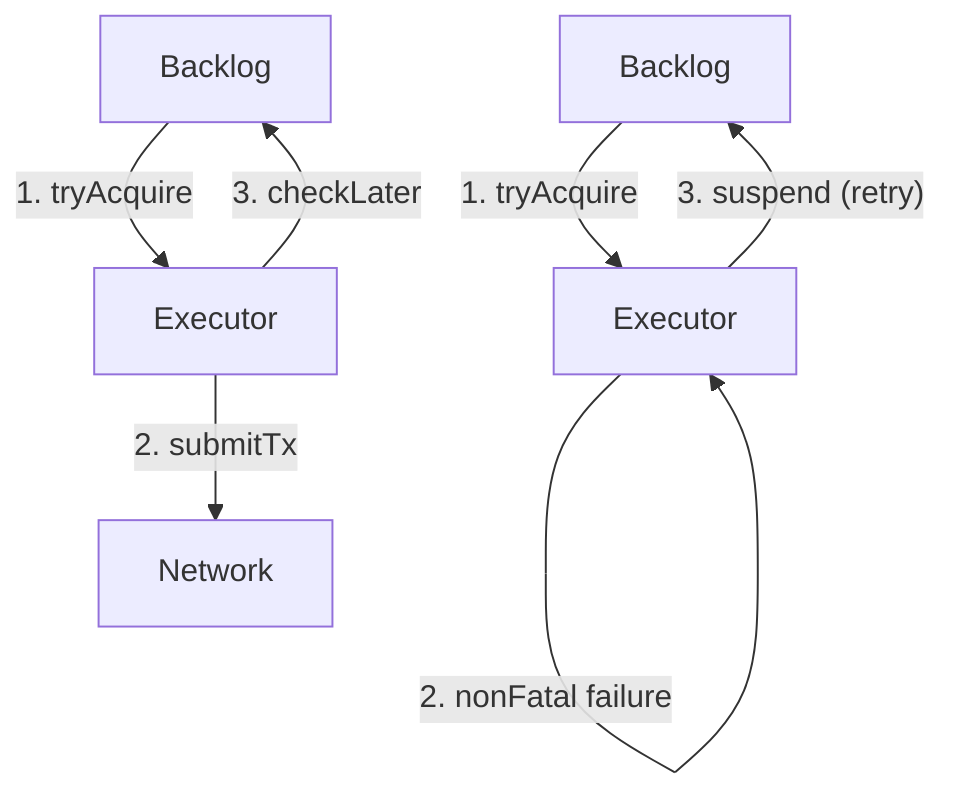

# AMM Backlog

### Backlog <-> Executor

```mermaid
graph TD
    Bcklg[Backlog] -->|1. tryAcquire| Exec[Executor]
    Exec -->|2. submitTx| Ntwrk[Network]
    Exec -->|3. checkLater| Bcklg

    Bcklg1[Backlog] -->|1. tryAcquire| Exec1[Executor]
    Exec1 -->|2. nonFatal failure| Exec1
    Exec1 -->|"3. suspend (retry)"| Bcklg1
```